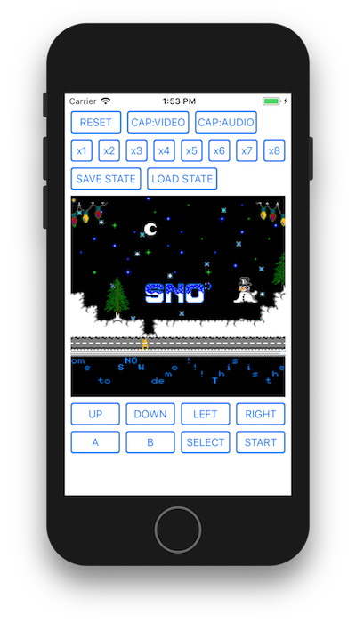

# NES Emulator for iOS

## About

The NES emulator implementation for iOS using [Cycloa](https://github.com/ledyba/Cycloa).



## How to use on Your Project

__IMPORTANT: Your Project's license must to GPLv3 or compatible if use it. (confirm the LICENSE section)__

### (1) Podfile

```
TODO
```

### (2) ViewController

#### implementation NESView deleagate and make properties if needed

```objective-c
@interface ViewController () <NESViewDelegate>
@property (nonatomic) NESView* nesView;
@property (nonatomic) NESKey* nesKey;
@end
```

#### alloc + init NESKey and NESView, and load ROM data

```objective-c
- (void)viewDidLoad
{
    [super viewDidLoad];
    _nesKey = [[NESKey alloc] init];
    _nesView = [[NESView alloc] initWithCGRect(0, 0, 256, 240)];
    _nesView.delegate = self;
    [self.view addSubview:_nesView];
    [_nesView loadRom:[NSData dataWithContentsOfFile:@"path-to-your-rom-file"]];
}
```

#### implement NESViewDeleagate method

```objective-c
- (void)nesView:(NESView*)nesView didDetectVsyncWithFrameCount:(NSInteger)frameCount
{
    [nesView tick:_nesKey];
}
```

> See the [example](Example/Example/ViewController.m)

## How to build example on your PC

```
git clone https://github.com/suzukiplan/nes-emulator-ios
cd nes-emulator-ios
cd Example
pod install
open Example.xcproject
```

## License

- NES Emulator for iOS: [GPLv3](LICENSE.txt)
- Cycloa: [GPLv3](https://github.com/ledyba/Cycloa)
- Example ROM - `Snow Demo by Tennessee Carmel-Veilleux`: Public Domain	 

> __NOTE:__ The liberal license of `NES Emulator for iOS` without Cycloa edition is exist but not open. Please contact SUZUKI PLAN directly about it.

